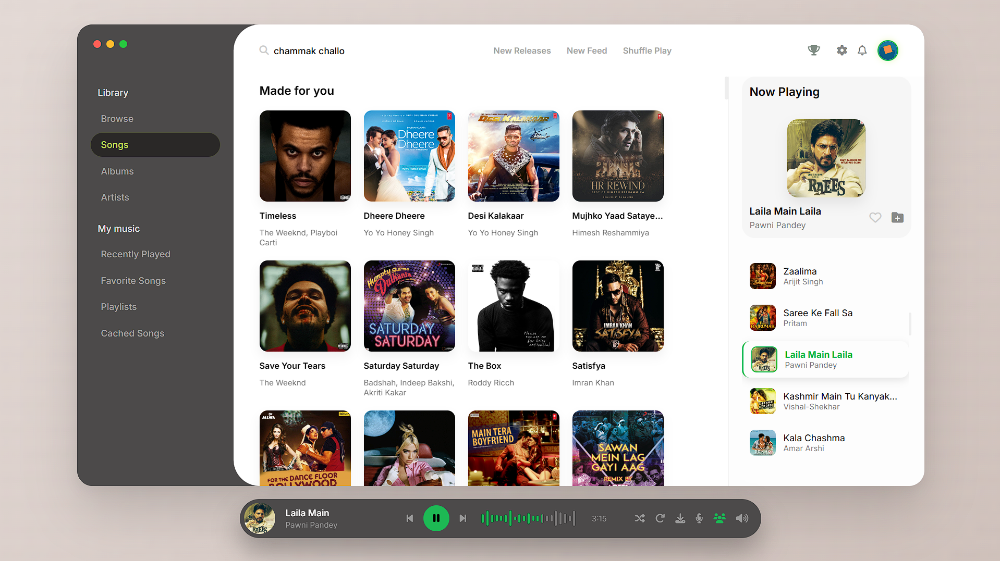
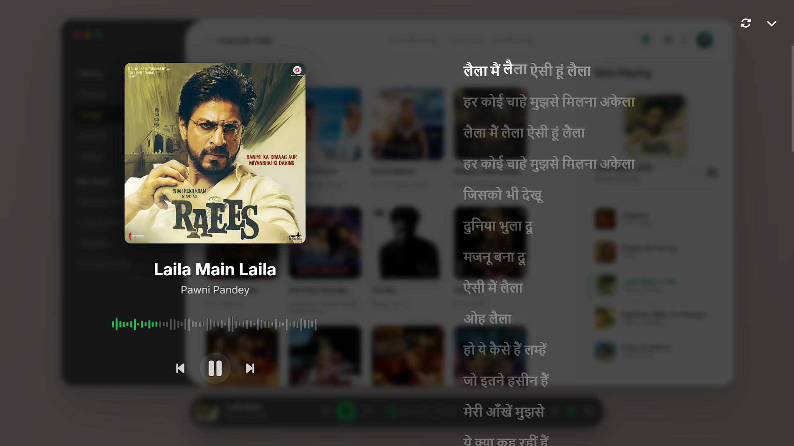
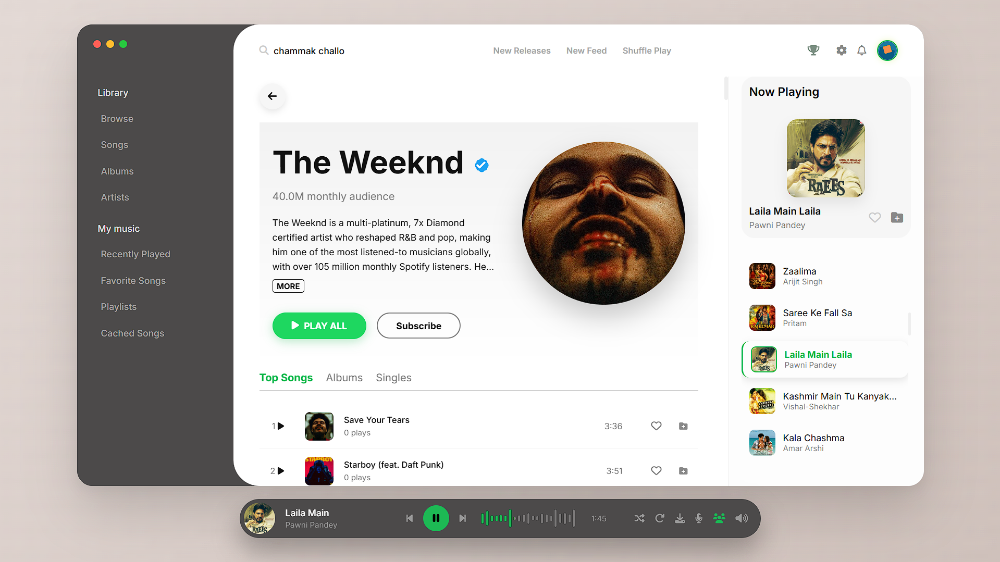
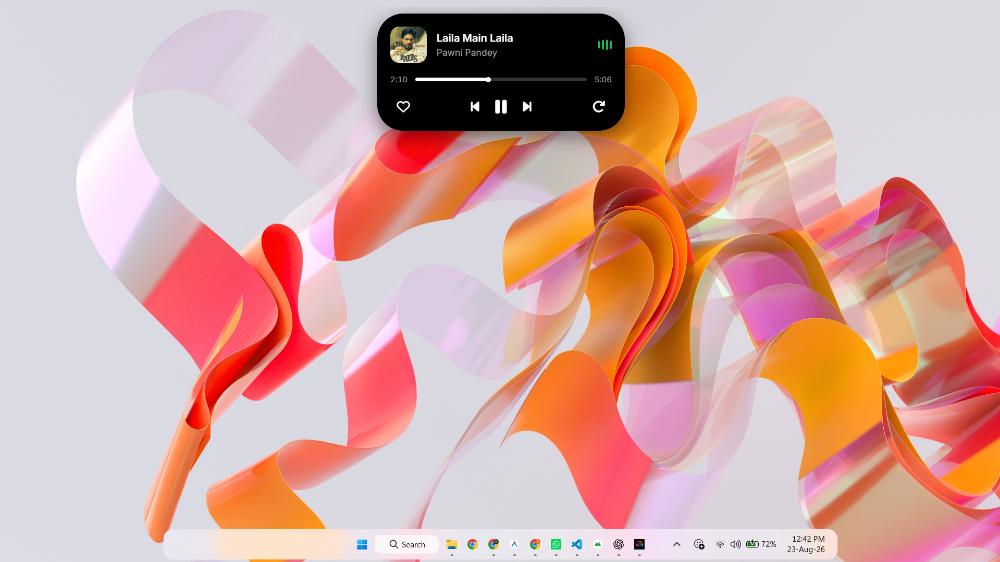

# IceBeats Desktop

**Modern Music Streaming Client for Windows**

Developed by **Official Valora Group**

---

## Overview

IceBeats Desktop is a fast, lightweight, and modern music streaming client for Windows. Designed with an elegant glassmorphism user interface, native desktop features, and seamless cloud synchronization with the IceBeats Android application.

---

## Features

- **Full Catalog Streaming** - Instant access to a vast music collection with high-fidelity audio playback.
- **Dynamic Island Overlay** - Interactive floating mini-player pill at the top of your Windows screen.
- **Instant QR Code Login** - Pair with your IceBeats Android App in seconds by scanning a QR code on your screen.
- **Unified Cloud Library** - Real-time sync for favorite songs and custom playlists powered by Supabase.
- **Synchronized Lyrics** - Live scrolling lyric display with karaoke mode.
- **Modern Glassmorphism UI** - Curated color palettes, customizable accent themes, and smooth micro-animations.
- **Ad-Free Experience** - Clean, focused listening with zero interruptions.

---

## Quick Links

- **Official Website:** [icebeats.pages.dev](https://icebeats.pages.dev)
- **WhatsApp Community:** [Join Official Channel](https://whatsapp.com/channel/0029Vb8V2qh8V0tpL0VDky0M)
- **Feedback & Support:** [masukanuntukdev.pages.dev](https://masukanuntukdev.pages.dev)
- **GitHub Repository:** [github.com/B7ByteMe/IceBeats-Desktop](https://github.com/B7ByteMe/IceBeats-Desktop)

---

## Screenshots

  
    
  
    
  
    
  

---

## Downloads & Installation

Download the latest version from the **[Releases](https://github.com/B7ByteMe/IceBeats-Desktop/releases)** page:

### 🪟 Windows (10 / 11)
- **Installer:** Download `IceBeats-v0.0.5-setup.exe` and follow the setup wizard.
- **Portable:** Download `IceBeats-v0.0.5-portable.exe` to run directly without installation.

### 🐧 Linux
- **AppImage:** Download `IceBeats-v0.0.5-linux.AppImage`, make it executable (`chmod +x`), and run.
- **Debian / Ubuntu:** Download `IceBeats-v0.0.5-linux.deb` and install via `sudo dpkg -i`.

### 🍎 macOS
- **Apple Disk Image:** Download `IceBeats-v0.0.5-mac.dmg`, open it, and drag IceBeats into your Applications folder.

---

## Community & Feedback

- Community Channel: [WhatsApp Channel](https://whatsapp.com/channel/0029Vb8V2qh8V0tpL0VDky0M)
- Feedback Portal: [masukanuntukdev.pages.dev](https://masukanuntukdev.pages.dev)
- Bug Reports: [GitHub Issues](https://github.com/B7ByteMe/IceBeats-Desktop/issues)

---

## License

This project is licensed under the **GNU General Public License v3.0**.

Developed by **Official Valora Group**. All rights reserved.
